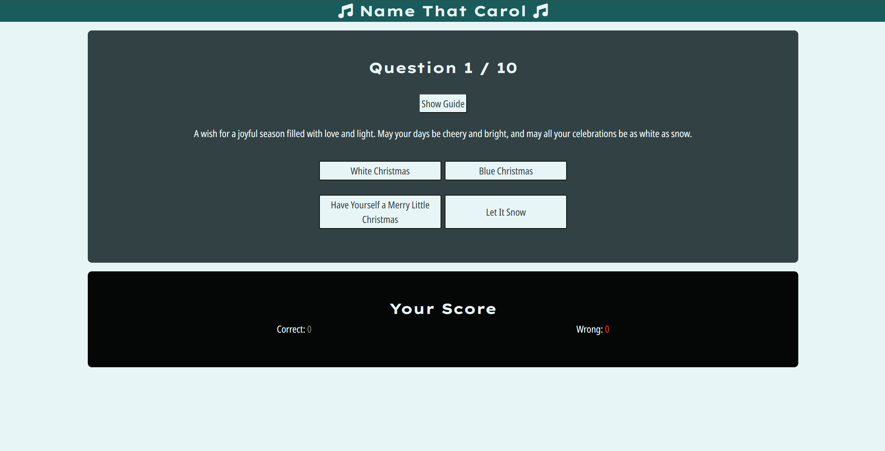
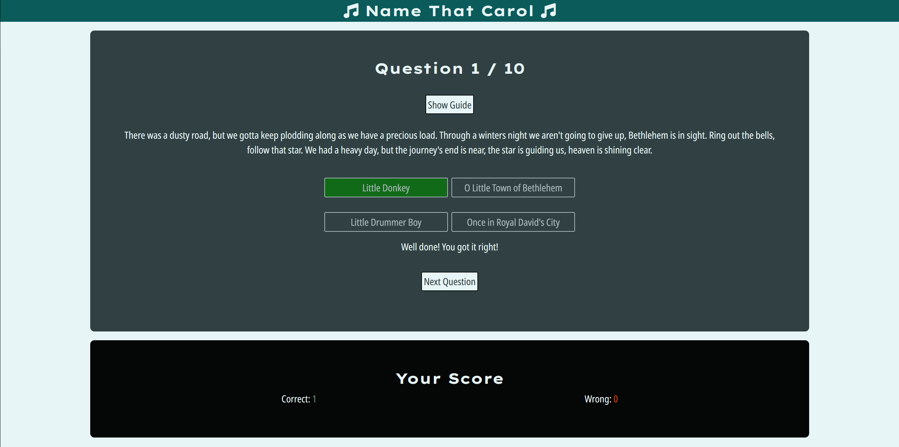
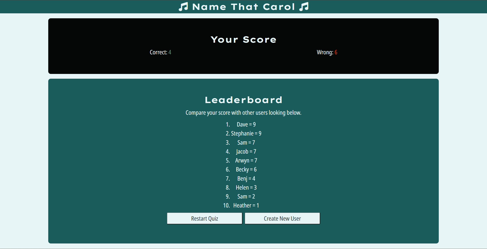
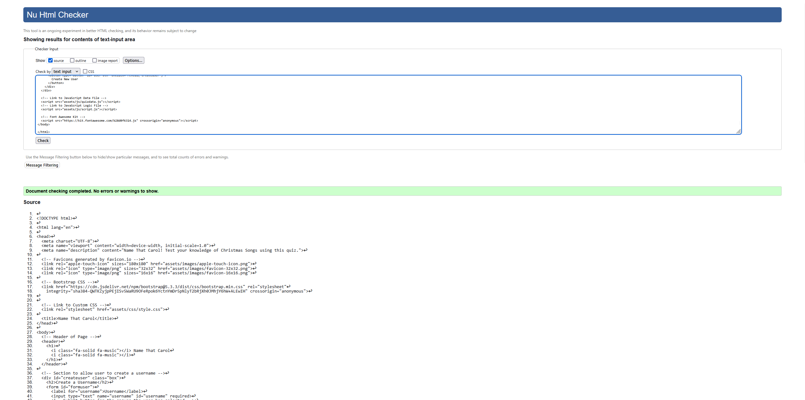
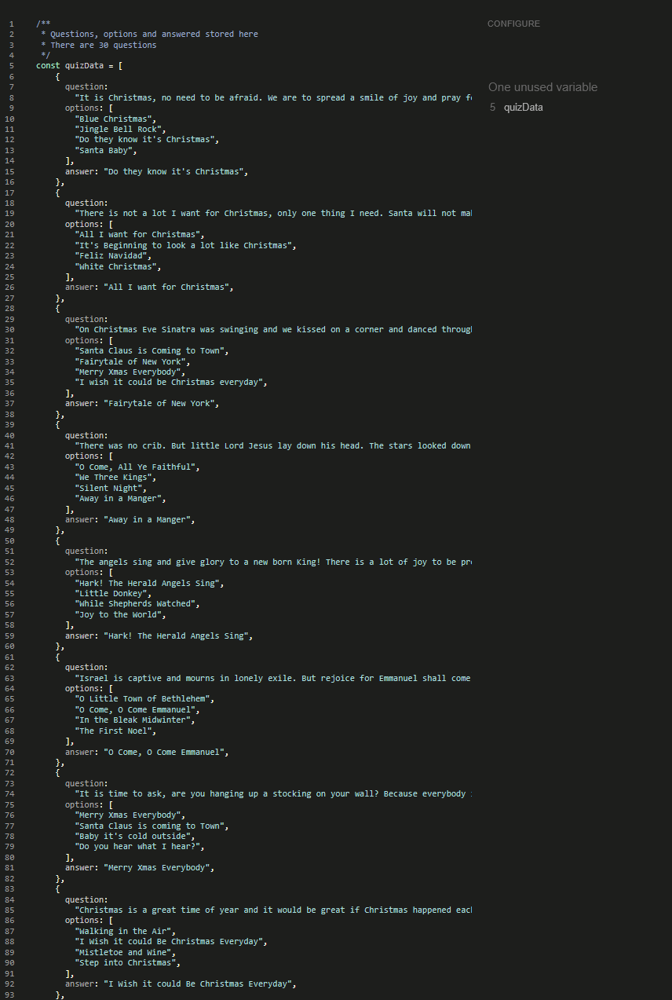
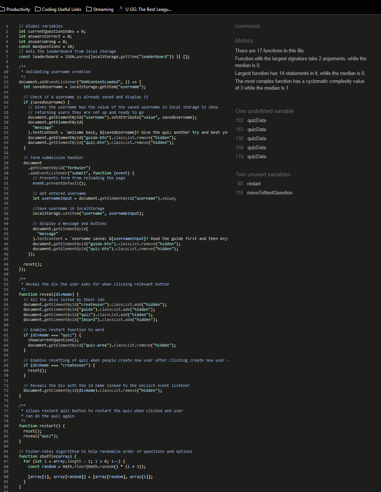

# Name That Carol

**Name That Carol** The aim of the website is to provide users with a way to test their knowledge of Christmas Songs in a fun and engaging way that encourages them to invite their friends to see if they can beat their score.

## User Stories & Wireframes

### User Stories

The decision to make this website is due to the user stories found [here](userstory.md).

### Wireframes

From the user stories you can see the wireframes that were mocked up below.

#### Home Page

#### Account Creation/Management

#### Question Page

#### Leaderboard

## Responsive Design

## Features

Below are the features for the website and at the end is listed any features that weren't able to be implemented but would be with more time.

### Existing Features

#### Username Creation

- When the user first accesses the page they are invited to create a username, the user can either hit enter or click submit user
- Once created it shows a message that they have created a username and it has been saved and the guide and quiz buttons appear
- If the user is revisiting the site they are welcomed back, their username appears in the username input field and they can go to the guide or the quiz

#### Guide

- Here the user can read how to do the quiz
- They can then click go to quiz when they are ready
  - If they accessed the guide from the username creation when they click the go to quiz button it starts them from question 1
  - If they accessed the guide from the quiz area when they click go to quiz button they join the quiz from where they left off

#### Quiz

- Here the user can test their knowledge on christmas songs, both carols and popular songs
- They can click the answer they think it is by clicking the name of the song
- After they clicked the song a message appears informing them if they got it correct or wrong
- The correct answer goes green, if the user got it wrong their answer goes red
- A next question button appears so the user can continue with the quiz when they are ready
- The scoreboard then updates either the correct or wrong score
- The question order is randomised
- For each question the order of the options are randomised as well
- The randomisation enables for users to redo the quiz and have to read through the questions and options carefully rather than remembering where to click

#### Leaderboard

- Here the user can see their score in terms of how many they got correct and how many wrong
- They also can compare their score to others who have used the quiz on their browser on that device
- There is also a button that allows them to restart the quiz if they so wish
- There is also a button that allows them to go back to user creation in case they want to enter a new username or a friend wants to give the quiz a go on their device

### Features Left to Implement

- Create a login database by asking for user to create a password when they create their username so people can create permanent accounts which would allow them to:
  - Track their scores and comapre to past attempts
  - Compare to various leaderboards
  - Add friends
  - Access future quizzes we may implement
- Store the high scores in the database and generate leaderboards that are:
  - Friends
  - Local
  - National
  - Global
- Have a search function on the leaderboard to allow a user to find themselves easily

## Testing

The website has been tested; including internal (buttons and navbar) & external links, responsive design, and forms; on Opera GX, Google Chrome, Mozilla Firefox, Microsoft Edge, and Safari.

### Fixed Bugs

- Buttons were showing at the wrong point, so I added an event listener with a class list to the relevant buttons
- Quiz Data was not shuffling due to missing [ ] at the correct points
- Show Guide and Go to Quiz buttons on username page were needing to be double clicked due to onclick in HTML and addEventListeners in the JS file, tidied up the function reveal() which is onclick for the buttons in HTML file
- Quiz wasn't revealing itself after showing user their final score using Go to Quiz button in scoreboard section, created an onclick function of restart that accesses reset and reveal functions in JS
- Answer was undefined after user submitted answer due to answer variable wasn't in the selectAnswer function
- Leaderboard was not showing due to incorrect use of JSON.parse and JSON.string, edited how this was used in the JS file so that it worked
- Leaderboard had names coming back as undefined because I was using the wrong name for list item, I was using score.username therefore this was fixed by changing score.username to the correct name of score.name
- Buttons were changing background colour after answer was submitted as I was trying to get the data and not an element when using the correctAnswer variable to try and change the style, therefore used userAnswer variable which is an element and created a class called actualAnswer using an if statement for the correct answer in the forEach function for the options
- Using document.getElementsByClassName.style.backgroundColour wasn't working to style the correct answer if the user got it wrong, therefore changed it to querySelector instead to get it to work

### Unfixed Bugs

- None

### Links and Actions

| Location                                  | Link / Button                         | Expected Action                                                                                                                                                                                                                     | Pass / Fail |
| ----------------------------------------- | ------------------------------------- | ----------------------------------------------------------------------------------------------------------------------------------------------------------------------------------------------------------------------------------- | ----------- |
| Username Creation                         | Username not entered                  | Tell user to fill in the field                                                                                                                                                                                                      | Pass        |
| Username Creation                         | Username Entered and Submit Clicked   | Reveal message that tells user, username was successfully created and guide and quiz buttons                                                                                                                                        | Pass        |
| Username Creation                         | Username Entered and user hit enter   | Reveal message that tells user, username was successfully created and guide and quiz buttons                                                                                                                                        | Pass        |
| Username Creation                         | If username is stored locally already | Username is shown in input field for username and a welcome back message and guide and quiz buttons are revealed as well                                                                                                                                                                             | Pass        |
| Username Creation                         | Click Show Guide                      | Hide username creation and reveal guide                                                                                                                                                                                             | Pass        |
| Username Creation                         | Click Go to Quiz                      | Hide username creation and reveal quiz                                                                                                                                                                                              | Pass        |
| Guide Div accessed from Username Creation | Click Go to Quiz                      | Hide guide and reveal quiz with question 1 at top and question with options button below                                                                                                                                            | Pass        |
| Guide Div accessed from Quiz div          | Click Go to Quiz                      | Hide guide and reveal quiz with the last question the answer was on and the options button below                                                                                                                                    | Pass        |
| Quiz Div                                  | Click Show Guide                      | Reveal guide                                                                                                                                                                                                                        | Pass        |
| Quiz Div                                  | Click Correct Answer                  | Submit selected answer and if answer is correct the answer goes green and a message below appears congratulating the user and correct score goes up by 1 and a button saying Next Question appears while all the answer buttons get disabled                  | Pass        |
| Quiz Div                                  | Click Wrong Answer                    | Submit selected answer and if answer is wrong the user answer goes red and the correct anwer goes green and a message below appears telling the user what the correct answer was and wrong score goes up by 1 and a button saying Next Question appears while all the answer buttons get disabled | Pass        |
| Quiz Div                                  | When final question has been answered | Hide question area and only show the scoreboard and leaderboard with a button Restart Quiz appearing                                                                                                                                | Pass        |
| Leaderboard                               | When restart quiz is clicked          | Reveal question area again above scoreboard with question 1 and the options, reset scoreboard to 0 for correct and wrong                                                                                                            | Pass        |
| Leaderboard                               | When create new user is clicked       | Reveal create user area and hide all other areas                                                                                                                                                                                    | Pass        |

### Validator Testing

- Lighthouse Score

  - Below you can see my lighthouse score tested on Chrome Incognito Mode

  - Homepage

  

- HTML

  - No errors were returned when passing through the official W3C Validator, see images below for each page.

    - Homepage

    

- CSS

  - Put CSS through Autoprefixer to ensure it works on all browsers
  - No errors were found when passing through the official Jigsaw validator, see links below.

  

- JavaScript

  - I have set the quiz data to one file and the logic to another file
  - quizData is defined in the quizdata.js file not the script.js file therefore is listed as unused in first screenshot and undefined on the second screenshot
  - The two unused functions in the second screenshot mentioned are used via onclick in HTML

  

  

## Deployment

This section desribes how I deployed my website

- The site was deployed to GitHub pages. The steps to deploy are as follows:
  - In the GitHub repository, navigate to the "Settings" tab
  - Under "Code and automation" selected "Pages"
  - Ensure "Deploy from branch" is selected
  - In the "Branch" section "main" was selected as the branch then "/root" was selected
  - Click "save" and the GitHub Pages was deployed

The live link can be found [here](https://sambailey6194.github.io/name-that-carol/).

## Cloning

This section describes how other software developers can clone the code to edit it elsewhere

- To clone the code so you can edit it yourself please follow the below:
  PLEASE NOTE THIS IS FOR WINDOWS COMMAND LINE
  - In the GitHub repository click the dropdown for '<> code'
  - Ensure you are on 'local' and have 'https' selected, then copy the URL by clicking the symbol next to the URL box
  - Once copied in the search bar on your taskbar type in 'cmd' and open 'Command Prompt' or 'Comman Line'
  - In command line type 'git clone' and paste the url next to it
  - In file explorer locate 'This PC' down the side, then 'local disk' (usually the :C drive), then 'users', then your user, then find the folder called 'photo-guides'
  - You now have access to all the code and files locally
  - If you want to edit the code, please ensure you creat a new branch in the software you are using enabling us to potentially see the edits you have done before uploading them to the original GitHub repository
  - To create a new branch that depends on the software you are using, please google how to do this for your software

If you aren't on windows please google how to get a GitHub repository stored locally on your OS

## Credits

Below are my credits for where I got inspiration for some of the code, where the content came from and where media is from.

### Code

- The border-box CSS code has been inspired by Love Maths
- The scoring design has been inspired by Love Maths
- The HTML structure and JS structure for the quiz has been inspired by Code Pickers blog post on Medium found [here](https://medium.com/@codepicker57/building-an-interactive-quiz-with-html-css-and-javascript-efe9bd8129e2).
- Some of the other JS coding concepts has been used from Love Maths as well
- The username creation code has been inspired by a geekforgeeks article found [here](https://www.geeksforgeeks.org/how-to-create-a-textfield-to-enter-a-username-and-save-it-on-a-website/)
- Got guidance in how to use fisher-yates algorithim from this video [here](https://www.youtube.com/watch?v=FGAUekwri1Q)
- Leaderboard code in JS file was influenced by this [article](https://michael-karen.medium.com/how-to-save-high-scores-in-local-storage-7860baca9d68) and these two videos; [Saving Leaderboard](https://www.youtube.com/watch?v=DFhmNLKwwGw&list=PLB6wlEeCDJ5Yyh6P2N6Q_9JijB6v4UejF&index=8), [Showing Leaderboard](https://www.youtube.com/watch?v=jfOv18lCMmw&list=PLB6wlEeCDJ5Yyh6P2N6Q_9JijB6v4UejF&index=9)
- Some of the CSS styling has been done via bootstrap library

### Content

- All icons are from font awesome
- All fonts are from Google Fonts
- 12 of the quiz questions were made up by myself
- 18 of the quiz questions were generated by ChatGPT, after I had written the first 12
